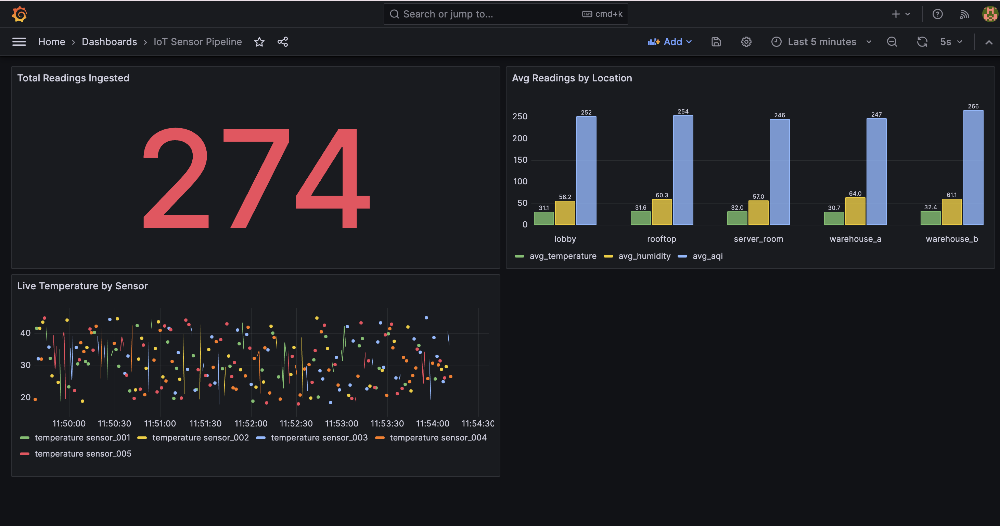

# IoT Real-Time Streaming Pipeline

A production-style real-time data pipeline that simulates IoT sensor networks,
streams events through Apache Kafka, persists data in PostgreSQL, and visualises
live metrics in Grafana — all containerised with Docker Compose.

## Architecture

```
IoT Sensors (simulated)
       │
       ▼
Python Producer  →  Apache Kafka (topic: iot-sensors, 3 partitions)
                              │
                              ▼
                    Python Consumer (validates + processes)
                              │
                              ▼
                         PostgreSQL  →  Grafana (live dashboard, 5s refresh)
```

## Tech Stack

| Layer | Technology |
|---|---|
| Message queue | Apache Kafka 7.5 + Zookeeper |
| Data ingestion | Python 3.11, kafka-python |
| Storage | PostgreSQL 16 |
| Visualisation | Grafana 10.2 |
| Infrastructure | Docker Compose |

## Features

- Simulates 5 IoT sensors across 5 locations (temperature, humidity, pressure, air quality)
- Producer publishes 1 event/second per sensor into a 3-partition Kafka topic
- Consumer validates readings and persists to PostgreSQL with end-to-end latency tracking
- Grafana dashboard auto-refreshes every 5 seconds with live time-series and aggregation panels
- Fully containerised — spins up with a single `docker compose up -d`

## Quick Start

**Prerequisites:** Docker Desktop, Python 3.11

### 1. Clone the repo

```bash
git clone https://github.com/YOUR_USERNAME/iot-kafka-pipeline.git
cd iot-kafka-pipeline
```

### 2. Start all infrastructure

```bash
docker compose up -d
```

### 3. Create the Kafka topic

```bash
docker exec kafka kafka-topics --create \
  --topic iot-sensors \
  --bootstrap-server localhost:9092 \
  --partitions 3 \
  --replication-factor 1
```

### 4. Create the database table

```bash
docker exec -it postgres psql -U iotuser -d iotdb -c "
CREATE TABLE sensor_readings (
    id           SERIAL PRIMARY KEY,
    sensor_id    VARCHAR(20)   NOT NULL,
    location     VARCHAR(50)   NOT NULL,
    temperature  NUMERIC(5,2)  NOT NULL,
    humidity     NUMERIC(5,2)  NOT NULL,
    pressure     NUMERIC(7,2)  NOT NULL,
    air_quality  INTEGER       NOT NULL,
    timestamp    TIMESTAMPTZ   NOT NULL,
    ingested_at  TIMESTAMPTZ   NOT NULL DEFAULT NOW()
);
CREATE INDEX idx_sensor_id ON sensor_readings (sensor_id);
CREATE INDEX idx_location  ON sensor_readings (location);
CREATE INDEX idx_timestamp ON sensor_readings (timestamp DESC);"
```

### 5. Install Python dependencies

```bash
python3.11 -m venv venv
source venv/bin/activate
pip install -r requirements.txt
```

### 6. Run the pipeline

Open two terminals:

**Terminal 1 — Producer:**
```bash
source venv/bin/activate
python src/producer.py
```

**Terminal 2 — Consumer:**
```bash
source venv/bin/activate
python src/consumer.py
```

### 7. Open Grafana

Go to [http://localhost:3000](http://localhost:3000) — login with `admin / admin`.

- Add a PostgreSQL data source: host `postgres:5432`, database `iotdb`, user `iotuser`, password `iotpass`, TLS disabled
- Create a new dashboard and add panels using the queries below

## Grafana Queries

**Live Temperature by Sensor** (Time series):
```sql
SELECT timestamp AS time, sensor_id, temperature
FROM sensor_readings
WHERE timestamp >= $__timeFrom() AND timestamp <= $__timeTo()
ORDER BY timestamp ASC
```
Add a **Partition by values** transform on `sensor_id` to split into one line per sensor.

**Avg Readings by Location** (Bar chart):
```sql
SELECT
  location,
  ROUND(AVG(temperature)::numeric, 2) AS avg_temperature,
  ROUND(AVG(humidity)::numeric, 2)    AS avg_humidity,
  ROUND(AVG(air_quality)::numeric, 0) AS avg_aqi
FROM sensor_readings
WHERE timestamp >= $__timeFrom() AND timestamp <= $__timeTo()
GROUP BY location
ORDER BY location
```

**Total Readings Ingested** (Stat):
```sql
SELECT COUNT(*) AS total_readings
FROM sensor_readings
WHERE timestamp >= $__timeFrom() AND timestamp <= $__timeTo()
```

## Project Structure

```
iot-kafka-pipeline/
├── src/
│   ├── models.py        # Sensor data model and random reading generator
│   ├── producer.py      # Kafka producer — simulates live sensor stream
│   └── consumer.py      # Kafka consumer — validates and persists to PostgreSQL
├── docker-compose.yml   # Full infrastructure (Kafka, Zookeeper, PostgreSQL, Grafana)
├── requirements.txt     # Python dependencies
└── README.md
```

## Key Concepts Demonstrated

- **Event streaming** — decoupled producer/consumer architecture via Kafka
- **Partitioning** — 3-partition topic enabling parallel consumption
- **Consumer groups** — offset tracking for fault-tolerant message processing
- **Data validation** — out-of-range sensor readings detected and dropped before storage
- **Infrastructure as code** — entire stack defined in a single docker-compose.yml
- **Observability** — live Grafana dashboard with time-series and aggregation queries
- **End-to-end latency tracking** — separate ingested_at and timestamp columns

## Dashboard Preview

